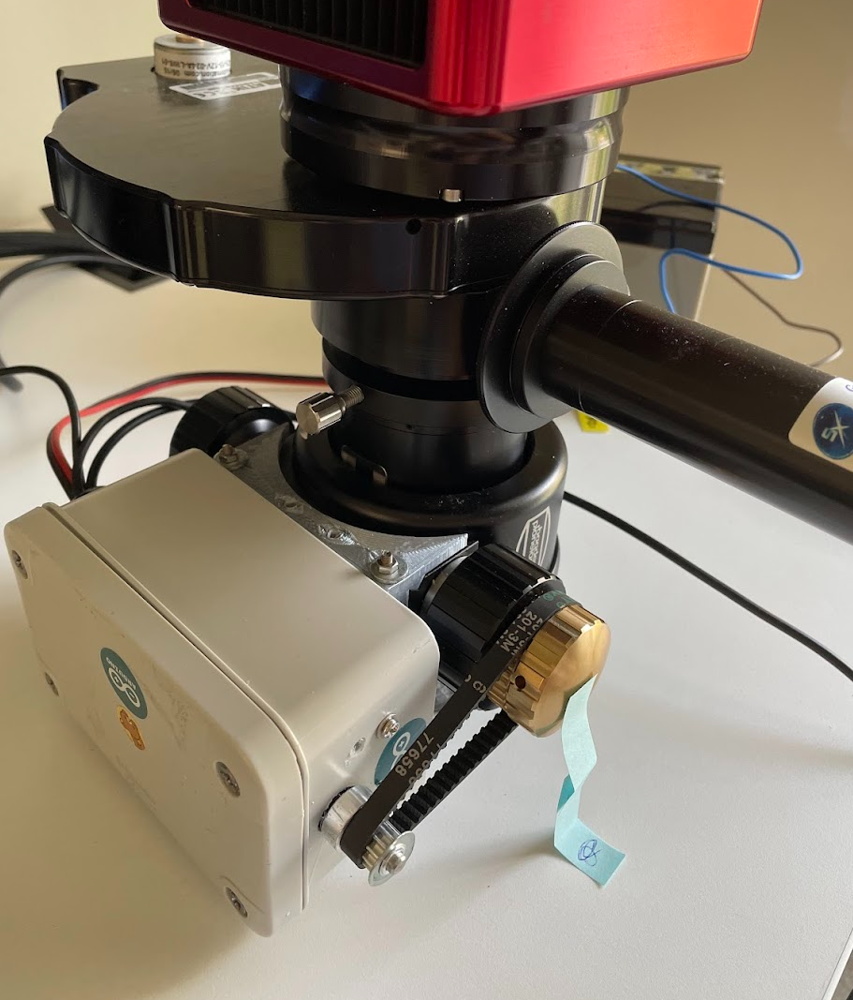

# nano-moonlite-clone

A moonlite focuser clone with temperature compensation based on the following hardware components:
* Arduino nano
* Nema17 stepper
* Sparkfun big easy stepper driver.
* DS18B20 temperature probe

Compatible with INDI and ASCOM based systems.

The driver includes backlash compensation. Depending on your mechanics, you may need to tweak the value of `BACKLASHSTEPS` in the code. When using with a nema17 stepper motor connected to a Baader diamond-steeltrack focuser with a toothed belt, almost no backlash could be measured in testing. 

# Parts

* Project box
* Arduino nano
* Nema17 stepper and Sparkfun big easy stepper driver
* DS18B20 temperature probe

Connect the temp probe and stepper driver to the pins specified in the moonlite.ino firmware. 
Flash the arduino with the firmware, assemble the parts in a project box. Attach to your focuser

# Features

## Temperature compensation

Enable temperature compensation in your client software (e.g. Kstars or NINA)
Set the temperature coefficient. The value ranges are +-63 due to limitations of the moonlite protocol. This coefficient needs to be determined experimentally as it depends on your telescope design and material. The firmware checks for temerature changes every 20seconds and applies the compensation if neecessary.

## Backlash compensation

The variable `BACKLASHSTEPS` in the code defines the number of steps of backlash to apply when changing direction. This has to be determined by experiment. This can be done with strips of tape and a marker. Setup one tape strip on the focus knob and one stationary. Draw a line on both. Now move the focuser a few times in one direction, then back the same number of steps to see how many extra steps are needed to get the tape and marker to align.

## Saving Focus position on restart

The default position on a cold start is 20,000 unless a previous position was saved.
However, if the saved position is less than 1000 or greater than 30,000 then the position gets reset to 20,000 on start. This can be useful if, for some reason you need to go to a position less than zero. For example, if the camera was manually moved by accident. A workaround for fully remote use, set the focus position to less than 1000, powercycle the device (or PC its connected to) then on start the position will be 20,000

## Extra serial command :TL# 

An extra command which is not part of the moonlite protocol is available. The command is ':TL#' and can be used to grab the current temperature reading from the probe to a much higher precision than available from the moonlite protocol. This command will return the current posision, the temperature reading and the temperature coefficient as a CSV string. See the temp_logger.py script for example of how to use this command.

